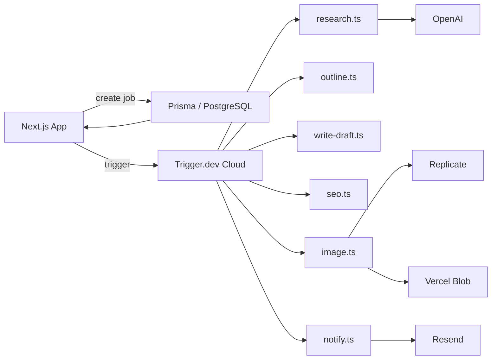

# Content Forge

> AI-powered content pipeline that turns a topic into researched outlines, written drafts, SEO metadata, cover images, and multi-format exports — on demand or on a schedule.

[](https://nextjs.org)
[](https://react.dev)
[](https://www.typescriptlang.org)
[](https://tailwindcss.com)
[](https://prisma.io)
[](https://trigger.dev)

[Features](#features) · [Stack](#stack) · [Architecture](#architecture) · [Getting Started](#getting-started) · [Deployment](#deployment) · [Contributing](./CONTRIBUTING.md) · [License](./LICENSE)

---

## Features

- **Topic-to-content pipeline** — Enter a topic (and optional source URL) and let the workflow research, outline, write, optimize, and illustrate a complete piece.
- **Multi-stage AI orchestration** — Research, outline, draft, SEO, image generation, and notifications run as durable background tasks via Trigger.dev.
- **Reusable templates** — Save job configurations as templates and launch new content with one click.
- **Cron scheduler** — Schedule recurring content jobs with custom CRON expressions and timezones.
- **Content library & exports** — Export finished drafts as Markdown, HTML, JSON, PDF, or PowerPoint.
- **Real-time progress** — Watch each stage complete live on the job detail page.
- **Email notifications** — Get notified when content is ready via Resend.
- **Dark mode & mobile-first UI** — Fully responsive interface with light/dark/system theme support.

## Stack

| Layer | Tech |
|-------|------|
| Framework | [Next.js 16](https://nextjs.org) (App Router) + [React 19](https://react.dev) + [TypeScript 5](https://www.typescriptlang.org) |
| Styling | [Tailwind CSS v4](https://tailwindcss.com) |
| Auth | [Clerk](https://clerk.com) |
| Database | PostgreSQL + [Prisma 7.8](https://prisma.io) |
| Background jobs | [Trigger.dev v3](https://trigger.dev) |
| AI | [OpenAI](https://openai.com) (GPT-4o-mini) + [Replicate](https://replicate.com) (FLUX Schnell) |
| Email | [Resend](https://resend.com) |
| Storage | [Vercel Blob](https://vercel.com/storage/blob) |
| PDF / PPTX | [pdf-lib](https://pdf-lib.js.org) + [pptxgenjs](https://gitbrent.github.io/PptxGenJS/) |

## Architecture



### Job lifecycle

1. **Research** — Scans the topic and source URL to gather key points.
2. **Outline** — Builds a structured article outline.
3. **Write Draft** — Generates the full draft using the outline and tone settings.
4. **SEO** — Produces title, meta description, keywords, and slug.
5. **Image** — Generates a cover image with Replicate and re-uploads to Vercel Blob for persistent URLs.
6. **Notify** — Emails the user when the content is ready.

## Getting Started

### Prerequisites

- Node.js 20+
- PostgreSQL database (local or hosted)
- Accounts with: Clerk, Trigger.dev, OpenAI, Replicate, Resend, Vercel

### 1. Clone and install

```bash
git clone https://github.com/yourname/content-forge.git
cd content-forge
npm install
```

### 2. Configure environment variables

```bash
cp env.example .env.local
```

Fill in all values. See the [Environment Variables](#environment-variables) section for details.

### 3. Set up the database

```bash
npx prisma migrate dev
```

### 4. Run Trigger.dev locally

```bash
npm run trigger:dev
```

This opens the Trigger.dev dashboard so you can watch jobs run.

### 5. Start the Next.js dev server

```bash
npm run dev
```

Open [http://localhost:3000](http://localhost:3000).

## Deployment

### Vercel

1. Push the repo to GitHub.
2. Import the project in [Vercel](https://vercel.com).
3. Add all environment variables from `.env.local` to the Vercel project settings.
4. Deploy.

### Trigger.dev

After deploying to Vercel, deploy the background tasks to Trigger.dev:

```bash
npm run trigger:deploy
```

> Important: `OPENAI_API_KEY`, `REPLICATE_API_TOKEN`, `RESEND_API_KEY`, `FROM_EMAIL`, and `BLOB_READ_WRITE_TOKEN` must also be set in the **Trigger.dev dashboard** so tasks can access them.

### Scheduler tasks

If you use the cron scheduler, deploy `cron-runner` via `npm run trigger:deploy` and ensure the task is registered in your Trigger.dev project.

## Environment Variables

| Variable | Service | Where else needed |
|----------|---------|-------------------|
| `NEXT_PUBLIC_CLERK_PUBLISHABLE_KEY` | Clerk | — |
| `CLERK_SECRET_KEY` | Clerk | — |
| `NEXT_PUBLIC_CLERK_SIGN_IN_URL` | Clerk | — |
| `NEXT_PUBLIC_CLERK_SIGN_UP_URL` | Clerk | — |
| `DATABASE_URL` | PostgreSQL | — |
| `TRIGGER_SECRET_KEY` | Trigger.dev | — |
| `TRIGGER_WEBHOOK_SECRET` | Trigger.dev | — |
| `OPENAI_API_KEY` | OpenAI | Trigger.dev dashboard |
| `REPLICATE_API_TOKEN` | Replicate | Trigger.dev dashboard |
| `RESEND_API_KEY` | Resend | Trigger.dev dashboard |
| `FROM_EMAIL` | Resend | Trigger.dev dashboard |
| `BLOB_READ_WRITE_TOKEN` | Vercel Blob | Trigger.dev dashboard |

## Scripts

| Script | Description |
|--------|-------------|
| `npm run dev` | Start Next.js development server |
| `npm run build` | Production build |
| `npm run lint` | Run ESLint |
| `npm run trigger:dev` | Run Trigger.dev locally |
| `npm run trigger:deploy` | Deploy tasks to Trigger.dev |

## Roadmap

See [`context/roadmap.md`](./context/roadmap.md) for the full phased plan.

Highlights:

- [x] Phase 1 — Core pipeline (research → draft → image → notify)
- [x] Phase 2 — SEO, email, content library, templates
- [x] Phase 3 — Cron scheduler, mobile UI, dark mode, open-source README
- [ ] Phase 4 — Blog post, demo video, social sharing

## Contributing

Contributions are welcome! Please read [`CONTRIBUTING.md`](./CONTRIBUTING.md) for guidelines on issues, pull requests, and development workflow.

## License

[MIT](./LICENSE) © Content Forge Contributors.
